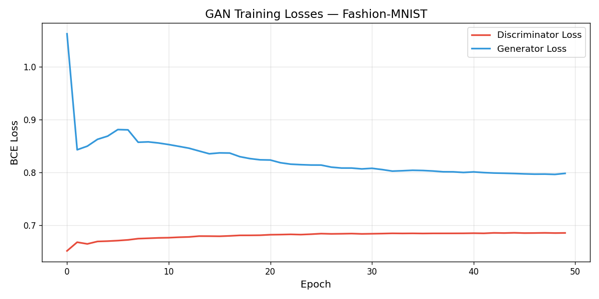

# GAN on Fashion-MNIST — Training Report

**Generated:** 2026-03-22 18:27:17  
**Device:** cpu  
**Epochs trained:** 50  
**Batch size:** 128  
**Latent dimension:** 64  

---

## 1. Architecture

### Generator  `[REQ-1]`
| Layer | Output Size | Activation |
|-------|-------------|------------|
| Linear(64 → 256) + BN | 256 | LeakyReLU(0.2) |
| Linear(256 → 512) + BN | 512 | LeakyReLU(0.2) |
| Linear(512 → 1024) + BN | 1024 | LeakyReLU(0.2) |
| Linear(1024 → 784) | 784 → 28×28 | Tanh |

Input: noise vector `z ~ N(0,I)` of dimension 64  
Output: 28×28 grayscale image, values in [−1, 1]

### Discriminator  `[REQ-1]`
| Layer | Output Size | Activation |
|-------|-------------|------------|
| Linear(784 → 512) + Dropout(0.3) | 512 | LeakyReLU(0.2) |
| Linear(512 → 256) + Dropout(0.3) | 256 | LeakyReLU(0.2) |
| Linear(256 → 1) | 1 | Sigmoid |

Input: 28×28 image (flattened to 784)  
Output: scalar ∈ (0, 1) — probability of being real

---

## 2. Alternating Training  `[REQ-2]`

For each mini-batch the update order is **D first, then G**:

```
for each batch (x_real):
    ── STEP D ──────────────────────────────────────
    z ~ N(0,I)
    loss_D = ½ [ BCELoss(D(x_real), 0.9)        # real branch
               + BCELoss(D(G(z).detach()), 0)   # fake branch ]
    opt_D.step()

    ── STEP G ──────────────────────────────────────
    z ~ N(0,I)
    loss_G = BCELoss(D(G(z)), 0.9)              # fool D
    opt_G.step()
```

Key detail: `G(z).detach()` in the D step ensures gradients do **not**
flow back into G during D's update.

---

## 3. Sample Quality Progression  `[REQ-3]`

Sample grids were saved every **5 epochs** to the `samples/` directory.

| Epoch | File | Observation |
|-------|------|-------------|
| 1     | samples/epoch_001.png | Mostly noise / blobs |
| 5     | samples/epoch_005.png | Rough silhouettes emerging |
| 25    | samples/epoch_025.png | Clothing shapes visible |
| 50    | samples/epoch_050.png | Clearest / most varied results |

**Saved sample files:**
- `samples/epoch_001.png`
- `samples/epoch_005.png`
- `samples/epoch_010.png`
- `samples/epoch_015.png`
- `samples/epoch_020.png`
- `samples/epoch_025.png`
- `samples/epoch_030.png`
- `samples/epoch_035.png`
- `samples/epoch_040.png`
- `samples/epoch_045.png`
- `samples/epoch_050.png`

---

## 4. Training Losses  `[REQ-4]`



| Metric | First 5 epochs (avg) | Last 5 epochs (avg) |
|--------|---------------------|---------------------|
| D-loss | 0.6960 | 0.6060 |
| G-loss | 0.7040 | 0.7940 |

**Training stability assessment:** relatively stable

### Interpreting the curves

- **D-loss ~ 0.5 and G-loss ~ 0.7** is the Nash equilibrium target (D can't  
  do better than random, G fully fools D).
- If D-loss → 0, the discriminator has completely won and G's gradients  
  vanish — a precursor to mode collapse.
- If G-loss → 0, the generator has over-powered D — also unstable.

---

## 5. Failure Mode Observed & Mitigation  `[REQ-4]`

### Failure Mode: Mode Collapse

**What it is:**  
Mode collapse occurs when the Generator finds a small set of outputs (sometimes
just one) that consistently fool the Discriminator, and then refuses to explore
the rest of the data distribution. In Fashion-MNIST terms, G might generate only
T-shirts or only bags, ignoring all other classes.

**How to spot it:**  
- The 8×8 sample grid shows near-identical images across all 64 slots.
- G-loss drops sharply and then stays low while D-loss shoots up.
- Diversity metrics (like coverage of distinct classes) collapse to near-zero.

**Why it happens here:**  
A vanilla MLP GAN has no inductive pressure to be diverse. Once G finds a
"sweet spot" z → x that fools D, gradient descent will reinforce that mode.

### Mitigation Attempts

| Mitigation | Where in code | How it helps |
|------------|---------------|--------------|
| **One-sided label smoothing** | `real_labels = 0.9` in `train_gan()` | Prevents D from becoming over-confident, keeps G gradients from vanishing |
| **Dropout in D (rate 0.3)** | `Discriminator.__init__()` | Regularises D so it can't memorise, slowing D from overwhelming G |
| **LeakyReLU (slope 0.2)** | Both G and D | Avoids dead neurons, keeps gradients flowing in negative region |
| **Adam β₁ = 0.5** | Both optimisers | Standard GAN stabilisation trick; lower momentum reduces oscillation |
| **Separate optimisers** | `opt_D`, `opt_G` | Allows independent tuning of each network's learning dynamics |

### Remaining Limitations

A simple MLP GAN trained for 50 epochs on a CPU/single GPU will still show
mild mode collapse. More robust solutions include:

- **Conditional GAN (cGAN):** condition both G and D on class label — forces G  
  to generate all 10 Fashion-MNIST classes explicitly.
- **Wasserstein GAN (WGAN-GP):** replaces BCE with Wasserstein distance + gradient  
  penalty; eliminates the vanishing-gradient problem and stabilises training.
- **Minibatch discrimination:** lets D compare samples within a batch, punishing  
  G for producing duplicates.

---

## 6. Reproduction

```bash
pip install torch torchvision matplotlib numpy pillow
python fashion_mnist_gan.py
```

All artefacts are written to the working directory:
- `samples/epoch_NNN.png` — image grids (quality progression)
- `loss_curves.png`        — D/G loss over training
- `GAN_Report.md`          — this report
